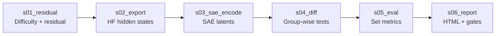

# Pipeline UI/UX specification — Stage 2 (Frontend developer brief)

**Audience:** Frontend engineers building a web experience for the **residual → export → SAE encode → diff → eval → report** track under `pipeline_2026/stage2/`.

**Goal:** One coherent user journey that explains *what* each stage does, *what data* it produces, and *why* it matters for failure-pattern discovery—without requiring the viewer to read Python or run jobs.

**Backend reality:** The canonical pipeline is file-based (CSV, JSON, NPZ, PNG, HTML). The frontend either (a) reads **pre-generated static artifacts** served from storage or a thin API, or (b) calls a small **bundle endpoint** that zips the `results/` tree for a run ID. This document assumes **read-only** consumption of those artifacts.

---

## 1. Process and logic (what the pipeline is doing)

| Step | Name | Core logic | Primary outputs (typical) |
|------|------|------------|---------------------------|
| **s01** | Residual | Logistic model predicts P(error) from cheap text features; **residual** = observed error − expected; rows bucketed into **High / Low / neutral** residual groups. | `*_residuals.csv` (or `.parquet`), `*_profile.json`, optional profile PNG |
| **s02** | Export | Same row order as CSV: HF model forward → one layer → **pool** (last token or mean) → vector per row `(N, d_in)`. | `*.npz` (`activations`), `*.meta.json` |
| **s03** | SAE encode | Each row vector through **pretrained** SAE (`SAE.from_pretrained`): `(N, d_in)` → `(N, d_sae)` sparse latents. | `*.npz`, `*.meta.json` (`representation_type: sae_latent`, `d_sae`, release/id) |
| **s04** | Diff | For each latent dimension, statistical test **High residual vs Low residual** (e.g. Welch); optional FDR; rank by effect / p-value. | `*_latents.csv`, `*.diagnostics.json`, optional membership/catalog CSV/JSON |
| **s05** | Eval | Aggregate **set-level metrics** (predictive utility, coverage, concentration, redundancy, stability) and residual-side summaries. | `*metrics*.json`, `leaderboard.csv`, optional PNG |
| **s06** | Report | Human-facing **HTML report**, **release_readiness.json** (gates), segment **audit.html** listings. | `mmlu_report.html`, `release_readiness.json`, `audit.html` per segment |

**Design implication:** The UI must preserve **row alignment**: every visualization that joins “behavior” and “representation” must use the **same row index** or a stable **`row_id`** / primary key carried from s01 through later stages.

---

## 2. Libraries and tools (recommended stack + course-aligned inspiration)

### 2.1 Application and data

| Need | Suggestion | Why |
|------|------------|-----|
| SPA / SSR | **React 18+** + **TypeScript**, or **Next.js** | Predictable component model for multi-step flows and static export. |
| Tables (wide CSV) | **TanStack Table** | Sorting/filtering for latents CSV and leaderboard without shipping huge DOM. |
| CSV/JSON fetch | Native `fetch` + **papaparse** (CSV) | Matches browser constraints; server can also pre-parse. |
| **NPZ** in browser | Prefer **backend/API** that exposes activations as JSON slices or Parquet; or **numpy**-compatible paths only for small smoke tests | Full `(N, d_sae)` arrays are large; do not block the main thread. |

### 2.2 Visualization

| Need | Suggestion | Why |
|------|------------|-----|
| Metric bars / line charts | **Apache ECharts** or **Vega-Lite** + **react-vega** | Good for JSON-driven scientific plots (error by subject, metric dashboards). |
| Pipeline / journey | **Horizontal stepper** + optional **React Flow** for a “data graph” (files as nodes) | Clarifies dependencies between stages. |
| Latent ranking | Horizontal bar chart (effect size) + linked table | Same mental model as SAELens / Neuronpedia-style ranking views. |

### 2.3 UX patterns borrowed from course resources ([CS 6966_5966 S26] Coding Resources)

Use these as **benchmarks**, not dependencies:

| Resource | What to imitate in your UI |
|----------|----------------------------|
| **[Neuronpedia](https://www.neuronpedia.org/)** | Clean feature-centric layout: **search**, **cards**, clear typography, subtle hierarchy; optional deep link “explore this latent” if your SAE exists on Neuronpedia. |
| **[SAE-Vis](https://github.com/callummcdougall/sae_vis)** (`pip install sae-vis`; Neuronpedia-style dashboards locally) | **Dashboard density**: top activations, summaries, and interpretable chunks—translate the *layout ideas* into your React components. |
| **[SAEBench interactive plots](https://www.neuronpedia.org/sae-bench)** | **Benchmark-style** comparison blocks when you show multiple runs/seeds or baseline vs method. |
| **SAELens tutorials** (loading pretrained SAEs) | Copy **exact metadata** display: `release`, `sae_id`, `d_in`, `d_sae`, layer/hook—users trust the run when provenance is visible. |

**Accessibility:** WCAG AA contrast, keyboard focus on stepper and tables, chart data available as **downloadable CSV** where possible (Neuronpedia-like tools often pair plots with tables).

---

## 3. User journey (end-to-end)

### Scene A — Landing / run selection

| | |
|--|--|
| **User action** | Opens the app; selects a **run** (e.g. `mmlu-real-2026-04-01`) or loads demo data. |
| **System** | Resolves manifest: list of stages, file URLs, optional `release_readiness.json` verdict. |
| **User sees** | Title, model names (behavioral vs representation), **pipeline stepper** (6 steps + Stage 1 baseline optional), status badges (complete / missing artifact). |
| **Expected feeling** | “I know what run this is and whether the pipeline finished cleanly.” |

### Scene B — Step 1: Residual (s01)

| | |
|--|--|
| **User action** | Clicks **Residual** on the stepper. |
| **System** | Loads residual table sample (first *k* rows), `*_profile.json`, and chart asset if present. |
| **User sees** | Short explainer: *We separate surprisingly hard errors from difficulty alone.* Table columns highlighted: `expected_error`, `residual_error`, `group`. Optional **histogram** or bar chart of group counts. |
| **Expected outcome** | User grasps **High vs Low residual** as the comparison axis for all later science—not raw accuracy. |

### Scene C — Step 2: Export (s02)

| | |
|--|--|
| **User action** | Clicks **Export**. |
| **System** | Shows `*.meta.json`: HF `model`, `layer_index`, `pooling`, `d_in`, path to source CSV. |
| **User sees** | Diagram: *Text → model → layer → pooled vector*. Warning chip if **layer index** and **SAE hook** might be misaligned (conceptually same as `pipeline_2026/docs/sae_checkpoints.md`). |
| **Expected outcome** | User understands that vectors are **surrogate internal states**, row-aligned with the CSV. |

### Scene D — Step 3: SAE encode (s03)

| | |
|--|--|
| **User action** | Clicks **SAE encode**. |
| **System** | Shows SAE **release**, **sae_id**, `d_sae`, device notes; clarifies **pretrained** checkpoint (not trained in-repo). |
| **User sees** | Before/after: dimension `d_in` → `d_sae`; optional “feature density” placeholder chart if you compute stats server-side. |
| **Expected outcome** | User accepts that diffing operates in **interpretable latent space**, not raw hidden units. |

### Scene E — Step 4: Diff (s04)

| | |
|--|--|
| **User action** | Clicks **Diff**. |
| **System** | Loads ranked latents CSV; diagnostics JSON (counts, thresholds, FDR flag). |
| **User sees** | **Volcano or bar ranking**: latent id vs statistic; table with `p_value` / `p_adjusted`; optional link-out to Neuronpedia search for that **latent id** + SAE id. |
| **Expected outcome** | User sees **which features** distinguish High vs Low residual—the discovery moment. |

### Scene F — Step 5: Eval (s05)

| | |
|--|--|
| **User action** | Clicks **Eval**. |
| **System** | Loads metrics JSON + leaderboard row(s). |
| **User sees** | Five-metric dashboard (cards or radar): predictive utility, coverage, concentration, redundancy, stability; footnote on multi-seed limitation if `n_runs` small. |
| **Expected outcome** | User judges whether patterns are **useful and stable**, not only significant. |

### Scene G — Step 6: Report and readiness (s06)

| | |
|--|--|
| **User action** | Clicks **Report** or **Release**. |
| **System** | Embeds or mirrors `mmlu_report.html`; shows `release_readiness.json` gates (pass/fail, violations). |
| **User sees** | Executive summary plus **verdict**; drill-down to per-subject issues; link to **audit** pages listing every file. |
| **Expected outcome** | User can **ship or cite** the run with clear pass/fail and artifacts list. |

---

## 4. Per-step expected result checklist (for design QA)

| Step | User should be able to answer (without reading code) |
|------|------------------------------------------------------|
| s01 | *What is residual error, and who is in High vs Low groups?* |
| s02 | *Which HF model and layer produced the vectors?* |
| s03 | *Which pretrained SAE and what latent width?* |
| s04 | *Which latent IDs are top-ranked, and are p-values FDR-adjusted?* |
| s05 | *Do the five metrics favor the method for this run?* |
| s06 | *Did release gates pass, and where is the full HTML report?* |

---

## 5. Content risks to surface in the UI (trust and transparency)

1. **Behavioral vs representation model mismatch** (for example API predictions vs HF activations): show a **prominent disclaimer** and, if available, secondary results using aligned groupings.
2. **NPZ size:** never load full activations in the main thread; use summaries, sampled rows, or server aggregates.
3. **Pretrained SAE:** state explicitly that features are defined by the **public checkpoint**, not custom-trained for this dataset unless you add that workflow later.

---

## 6. File map (where designers pull content)

Relative to repo root, after a full run:

- Stage 1 baseline: `pipeline_2026/stage1/results/` (including `audit.html` where generated)
- Stage 2 segments: `pipeline_2026/stage2/s0*/results/` (each may include `audit.html`)
- Integrated report: `pipeline_2026/stage2/s06_report/results/mmlu_report.html`
- Release: `pipeline_2026/stage2/s06_report/results/release_readiness.json`

**Dummy / demo tree:** `dummy/pipeline_2026/` — useful for UI development without GPUs.

---

## 7. Small style note (documentation English)

- Prefer **“use case”** (two words) over “usecase.”
- **“Frontend”** is acceptable as a noun in tech docs; **“front-end”** with a hyphen is also fine if your style guide requires it.

---

*This document is scoped to visualization and UX for the teaching-llms-errors pipeline; model training and SAELens usage remain in Python land.*
